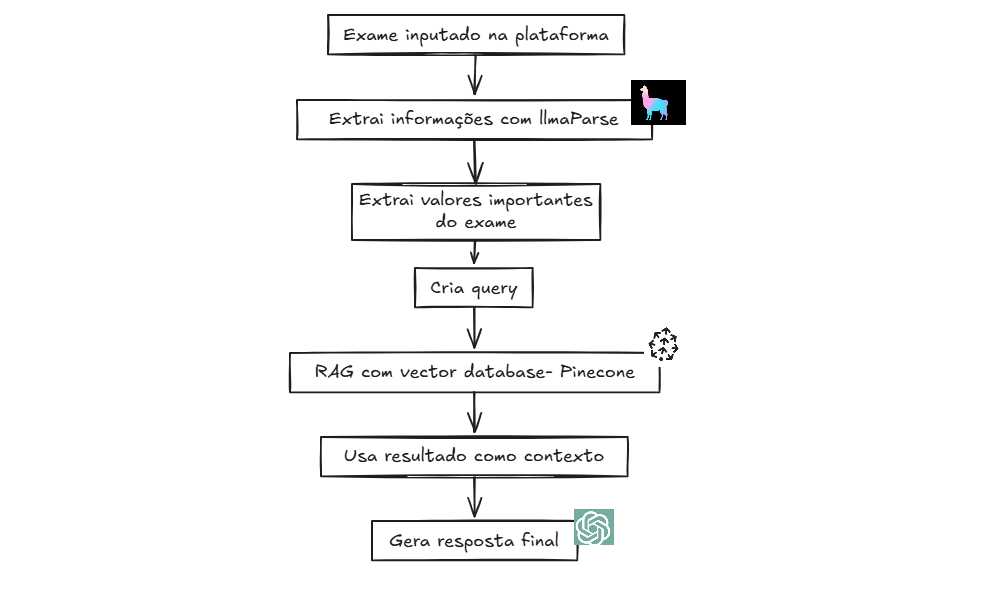
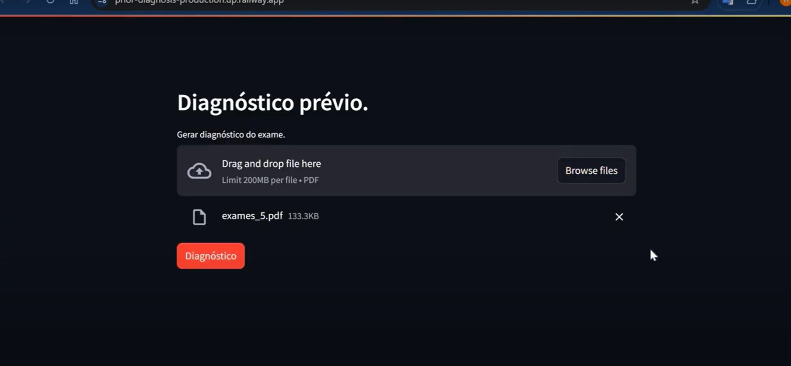

# prior-diagnosis


## Arquitetura


## Clique no video da aplicação
[](https://youtu.be/DAr3mveDe10)

# Análise Inteligente de Exames de Hemograma

## **Visão Geral**
Este projeto apresenta uma aplicação baseada em Inteligência Artificial (IA) voltada para a análise automatizada e inteligente de resultados de hemogramas. O objetivo é oferecer suporte aos profissionais de saúde ao interpretar exames, reduzindo o tempo de análise e minimizando possíveis erros em diagnósticos complexos.

## **Problema**
A análise de hemogramas é fundamental na medicina diagnóstica, especialmente em contextos de alta demanda. No entanto, ainda há lacunas significativas:
- Ausência de ferramentas que realizem interpretações automatizadas e contextualizadas.
- Diagnósticos tardios ou equivocados em casos complexos devido à sobrecarga dos profissionais.
- Dependência de análises manuais, que podem ser demoradas e subjetivas.

## **Soluções Existentes**
Foram analisadas as soluções disponíveis no mercado:
1. **Sistemas de Laboratório Automatizados**: Apresentam resultados de exames, mas sem oferecer interpretações ou diagnósticos sugeridos.
2. **Soluções Baseadas em IA**: Algumas, como a PathAI, utilizam IA para diagnósticos baseados em imagens, mas poucas focam em hemogramas quantitativos.
3. **Protocolos Manuais**: Ainda amplamente utilizados, porém sujeitos a variações subjetivas e maior consumo de tempo.

Essas soluções apresentam limitações, como falta de personalização, lentidão no diagnóstico e ausência de integração com informações contextuais do paciente.

## **Solução Proposta**
A aplicação desenvolvida oferece as seguintes funcionalidades:
- **Extração de Dados Estruturados**: Analisa arquivos PDF de exames para extrair dados relevantes, como níveis de hemoglobina, leucócitos e plaquetas.
- **Geração de Diagnósticos Sugestivos**: Baseada em resultados e dados contextuais (como idade, sexo e sintomas), sugere diagnósticos preliminares.

## **Metodologia de Validação**
Para validar a eficácia da ferramenta, foram realizados testes com duas médicas em um ambiente controlado. As etapas incluíram:
1. **Interação com a Ferramenta**: Análise de casos fictícios utilizando a aplicação.
2. **Avaliação de Precisão**: Comparação entre os diagnósticos gerados pela ferramenta e as interpretações manuais.
3. **Feedback Qualitativo**: Entrevistas para identificação de melhorias.

## **Resultados**
- **Precisão Diagnóstica**: 85% de concordância com os diagnósticos manuais.
- **Redução de Tempo**: Diminuição do tempo de análise de 10 minutos para 3 minutos por exame.
- **Satisfação das Médicas**: Feedback positivo sobre a intuitividade e aplicabilidade da ferramenta.

## **Impacto**
A ferramenta tem potencial para:
- Otimizar fluxos de trabalho em ambientes hospitalares.
- Reduzir erros humanos em análises críticas.
- Melhorar a qualidade do atendimento ao paciente.

## **Próximos Passos**
Com base no feedback das médicas, os próximos desenvolvimentos incluem:
1. **Inclusão de Novos Exames**:
   - Reticulócitos, citometria de fluxo, mielograma, biópsia óssea.
   - Cinética do ferro (ferro sérico, ferritina, índice de saturação do ferro, CTLfe).
   - Ultrassom cervical, RX de tórax, vitamina B12, bilirrubina indireta, Coombs direto, VHS.
2. **Integração de Análise de Gasometria Arterial**:
   - Automação dos cálculos relacionados à gasometria, permitindo identificação de condições graves e suporte à tomada de decisão em situações críticas.

A funcionalidade de análise de gasometria visa abordar um exame frequentemente desafiador e essencial em cenários de alta complexidade clínica.

---

## **Como Executar Localmente**
1. Clone o repositório:
   ```bash
   git clone https://github.com/HudsonArauj/prior-diagnosis.git
    ```

2. Acesse o diretório do projeto:
   ```bash
   cd analise-hemogramas
   ```
3. Instale as dependências:
   ```bash
   pip install -r requirements.txt
   ```
4. Execute a aplicação:
   ```bash
   streamlit run app.py
   ```


A aplicação estará disponível em `http://localhost:8000`.


## Pode acessar a aplicação em: [Análise de Hemograma](https://prior-diagnosis-production.up.railway.app/)

